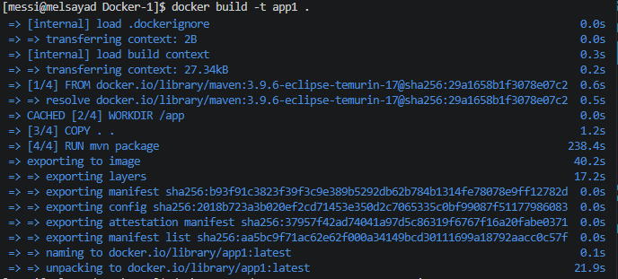
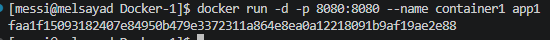
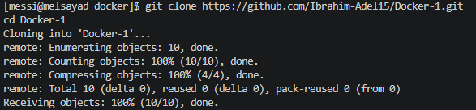

# Docker Lab - Day 1 🚀

## 📌 Project Structure
- Dockerfile created
- Spring Boot app cloned
- Containerized application

---

## 🔹 Clone

---

## 🔹 Build Image

---

## 🔹 Run Container

---

## 🔹 Test Application
http://localhost:8080

---

## 🔹 Stop Container

---

## ✅ Result
Successfully built and ran Spring Boot app inside Docker container.
