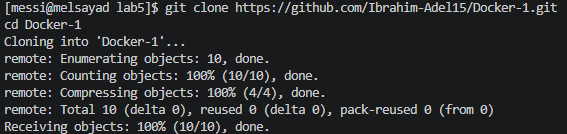
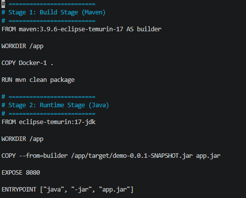

# Docker Lab 5 - Multi-Stage Build 🚀

## 📌 Project Overview
This lab demonstrates how to build and run a Spring Boot application using a **Multi-Stage Docker Build** to reduce image size and improve efficiency.

---

## 🔹 1. Clone Repository
Cloned the application source code from GitHub:



---

## 🔹 2. Dockerfile (Multi-Stage Build)
Created a Dockerfile with two stages:
- **Stage 1 (Build):** Uses Maven to build the application
- **Stage 2 (Runtime):** Uses Java 17 lightweight image to run the JAR



---

## 🔹 3. Build Docker Image (app3)
Built the Docker image using:

```bash
docker build -t app3 .
